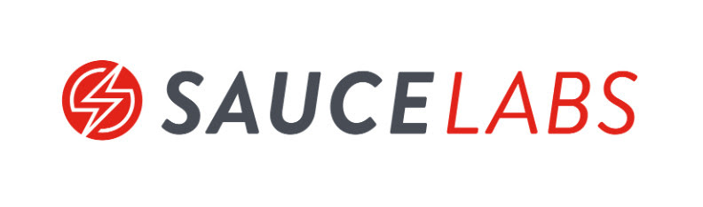

<div id="top"></div>
<br />
<div align="center">
  <a href="https://github.com/julianvargasalvarez/sauce-recipe">
    
  </a>
</div>

<h3 align="center">Integrating contract tests in a continuous integration pipeline</h3>

## About The Project

  
This is an example application that shows how to integrate contract testing for producer and consumer in a continuous integration pipeline by using SauceLabs tools, specially API Testing.

Take a look at the slides 'SauceCon22 - Contract Testing.pdf'

  
### Built With

* [Deno.js](https://deno.land/)
* [SauceLabs](https://saucelabs.com/)
* [Git](https://git-scm.com/)


## Getting Started

The project has two branches, `master` contains the basic template, `final` contains the final version with all the necesary code to run the example.

### Installation

1. Register for a free account at [https://saucelabs.com](https://saucelabs.com)
2. Clone the repo
   ```sh
   git clone git@github.com:julianvargasalvarez/sauce-recipe.git
   ```
3. Install Deno runtime [here](https://deno.land/#installation)
4. Install [Sauce Connect Proxy](https://docs.saucelabs.com/secure-connections/sauce-connect/installation/)


## Usage

Follow the step by step guide in 'APIT  - Contract Testing Workshop for SauceCon 2022.pdf', at the end your code should look just like the one in `final` branch.
